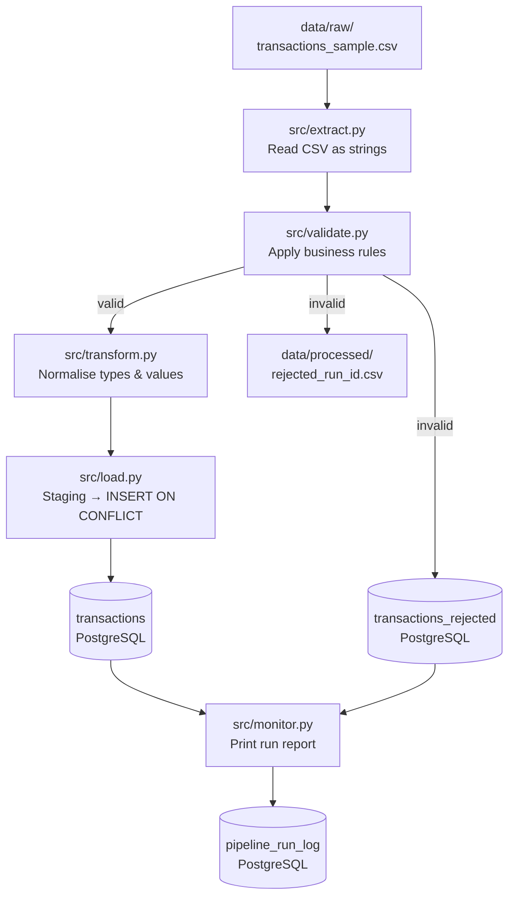

# Transaction Data Pipeline — Monitoring & Reliability

Hi! I'm **Syazantri Salsabila (Sasa)** 😊 and this is my Data Engineering Zoomcamp 2026 repository, extended into a portfolio project.

The pipeline ingests raw transaction-like CSV data, runs data quality checks, loads clean records into PostgreSQL, stores rejected records with error reasons, and prints an operational run report after each execution. It's a local simulation of the kind of reliability workflow I'd expect to work on as a Data Engineer.

> **Quick note on honesty:** This is a local dev simulation, not production-grade software. It's designed to show that I understand the *patterns* — staging/merge loads, validation, rejected-record handling, run logging, and operational docs — that real data platforms are built on.

---

## Why I Built This

While going through the Zoomcamp modules, I kept noticing that the exercises covered *how to move data* but not *how to trust it*.You can't just load data and hope for the best. You need to know:

- Which rows failed validation, and why?
- Can I safely re-run after a partial failure?
- What does the pipeline's health look like right now?

So I extended the repo with a small transaction pipeline that tries to answer those questions in a realistic (if simple) way.

---

## Architecture



---

## Tech Stack

| Layer | Technology |
|---|---|
| Pipeline language | Python 3.10+ |
| Data manipulation | pandas |
| Database | PostgreSQL 16 |
| DB client | SQLAlchemy 2 + psycopg2 |
| Containerisation | Docker Compose |
| Orchestration (reference) | Kestra — Module 2 work in `kestra/` |
| Infrastructure as Code (reference) | Terraform — GCS + BigQuery in `terrademo/` |
| Testing | pytest |

---

## Project Structure

```
.
├── README.md
├── docker-compose.yml          # Starts PostgreSQL + pgAdmin
├── requirements.txt
├── .env.example                # Copy to .env before running
│
├── data/
│   ├── raw/
│   │   └── transactions_sample.csv   # 25-row sample (20 valid, 5 intentionally broken)
│   └── processed/              # Rejected CSVs written here per run
│
├── sql/
│   ├── schema.sql              # DDL for all 3 tables
│   ├── quality_checks.sql      # Queries to verify data after ingestion
│   └── reconciliation.sql      # Cross-stage count reconciliation
│
├── src/
│   ├── extract.py              # Read raw CSV
│   ├── validate.py             # Apply validation rules row by row
│   ├── transform.py            # Normalise types and values
│   ├── load.py                 # Idempotent load into PostgreSQL
│   ├── monitor.py              # Print pipeline health report
│   ├── run_pipeline.py         # Main entry point
│   └── utils.py                # Shared DB engine + logger
│
├── docs/
│   ├── architecture.md         # Layer-by-layer explanation
│   ├── runbook.md              # How to run, rerun, and maintain
│   └── troubleshooting.md      # Common errors and fixes
│
├── tests/
│   └── test_validation.py      # Unit tests for validation (no DB needed)
│
├── kestra/flows/               # Module 2: Kestra orchestration
├── docker workshop/            # Module 1: Docker + NYC taxi ingestion
├── terrademo/                  # Module 1: Terraform GCS + BigQuery
└── my-homework/                # Module 1 homework answers
```

---

## How to Run Locally

### 1. Start the database

```bash
docker compose up -d
```

PostgreSQL starts on port `5432`, pgAdmin on port `8080`.
The `sql/schema.sql` init script runs automatically on first startup — you don't need to apply it manually.

```bash
docker compose ps   # pgdatabase should show "healthy"
```

### 2. Set up Python

```bash
pip install -r requirements.txt
cp .env.example .env   # only edit if you changed the default credentials
```

### 3. Run the pipeline

```bash
python -m src.run_pipeline
```

Custom input:
```bash
python -m src.run_pipeline --input data/raw/transactions_sample.csv
```

### 4. Run the tests

```bash
pytest tests/ -v
```

Tests cover the validation logic only — no database connection needed.

### 5. Inspect results

- **pgAdmin** → http://localhost:8080 (admin@admin.com / admin)
- **psql** → `psql -h localhost -U admin -d transactions_db`
- **Quality checks** → `psql -h localhost -U admin -d transactions_db -f sql/quality_checks.sql`

---

## What the Output Looks Like

After running on the sample CSV (25 rows: 20 valid, 5 broken on purpose):

```
========================================================
  TRANSACTION PIPELINE MONITOR REPORT
========================================================

  Latest Run
  Run ID              : a1b2c3d4
  Timestamp           : 2024-11-05 09:00:01
  Source file         : data/raw/transactions_sample.csv
  Status              : SUCCESS
  Total rows          : 25
  Valid rows          : 20
  Rejected rows       : 5
  Duplicates          : 1

  Null Counts (transactions table)
  transaction_id      : 0
  user_id             : 0
  amount              : 0
  currency            : 0
  status              : 0

  Transaction Status Breakdown
  SUCCESS             : 14
  FAILED              : 3
  PENDING             : 3

  Top Rejection Reasons
     1x  transaction_id is null or empty
     1x  amount must be > 0, got -100.0
     1x  transaction_status 'DECLINED' is invalid ...
     1x  currency is null or empty
     1x  duplicate transaction_id
========================================================
```

---

## Sample Data Quality Checks

The sample CSV has 5 intentionally broken rows to show what the validation catches:

| Row | Problem | Rejection reason |
|---|---|---|
| Row 21 | `transaction_id` is empty | `transaction_id is null or empty` |
| Row 22 | `amount = -100.00` | `amount must be > 0` |
| Row 23 | `transaction_status = DECLINED` | `transaction_status 'DECLINED' is invalid` |
| Row 24 | `currency` is empty | `currency is null or empty` |
| Row 25 | Same ID as row 1 | `duplicate transaction_id` |

---

## What This Shows

Here's what each part of the project is meant to demonstrate for a Data Engineer role:

| Skill | Where it shows up |
|---|---|
| Python automation | `src/` — 7 modules covering the full ETL flow |
| SQL + schema design | `sql/` — DDL, quality checks, reconciliation |
| Data validation | `src/validate.py` + 18 unit tests in `tests/` |
| ETL pipeline support | `src/run_pipeline.py` — ties all stages together |
| Rejected-record handling | `src/load.py` → DB table + local CSV |
| Pipeline monitoring | `src/monitor.py` — operational run report |
| Idempotent loading | Staging + `ON CONFLICT DO NOTHING` in `src/load.py` |
| Containerisation | `docker-compose.yml` + existing `Dockerfile` |
| Workflow orchestration | `kestra/flows/` — 4 Kestra flows from Module 2 |
| Infrastructure as Code | `terrademo/` — Terraform for GCS + BigQuery |
| Operational docs | `docs/runbook.md`, `docs/troubleshooting.md`, `docs/architecture.md` |

---

## Zoomcamp Foundation

The original coursework modules are kept in this repo as-is:

- **Module 1** — Docker + NYC taxi ingestion (`docker workshop/`), SQL homework (`my-homework/`), Terraform setup (`terrademo/`)
- **Module 2** — Kestra orchestration flows (`kestra/flows/`)

The `src/`, `sql/`, `data/`, `docs/`, and `tests/` directories are the portfolio extension I built on top of that foundation.

---

## What I'd Improve Next

A few things I'd add if this were going towards a real environment:

- Replace the CSV source with a REST API or message queue consumer
- Add a dbt layer for analytical transformations
- Wire `run_pipeline.py` into one of the Kestra flows for proper scheduling
- Deploy PostgreSQL to a managed cloud service (Cloud SQL or Supabase)
- Add a monitoring dashboard for `pipeline_run_log` metrics

---

