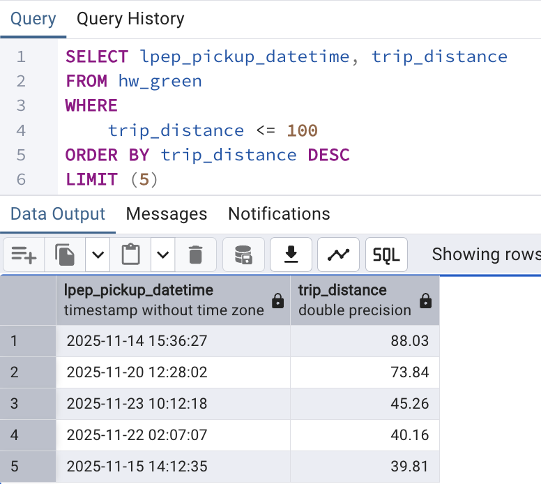
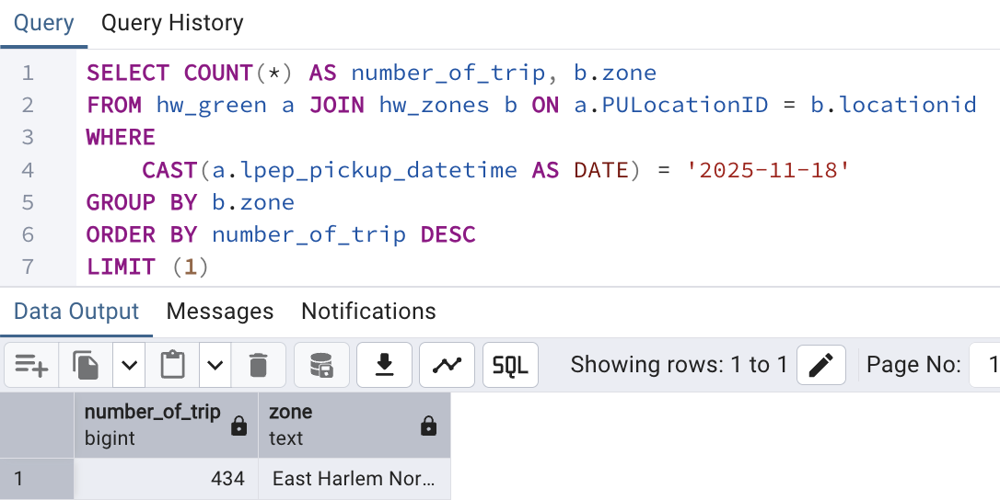
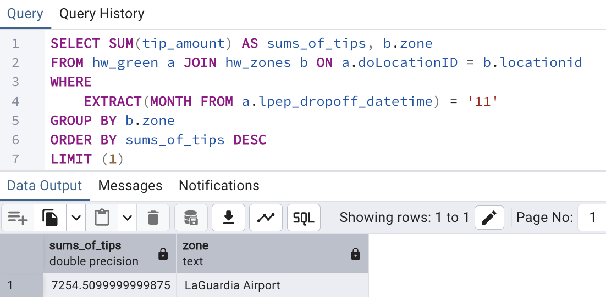

# Module 1
<span style="color:pink;"> Data Engineering Zoomcamp 2026 Homework Answer </span> by <span style="color:#f5e19f;"> Syazantri Salsabila </span>

1. **Understanding Docker images**
    <br>Q:
    Run docker with the `python:3.13` image. Use an entrypoint `bash` to interact with the container. What's the version of `pip` in the image?
    <br>A: 25.3
    
    ```
    sasa > docker run -it --entrypoint=bash python:3.13
    root@f989ad9e3991:/# pip --version
    pip 25.3 from /usr/local/lib/python3.13/site-packages/pip (python 3.13)
    root@f989ad9e3991:/# 
    ```
    
2. **Understanding Docker networking and docker-compose**
    Q: Given the following `docker-compose.yaml`, what is the `hostname` and `port` that pgadmin should use to connect to the postgres database?

    ```yaml
    services:
      db:
        container_name: postgres
        image: postgres:17-alpine
        environment:
          POSTGRES_USER: 'postgres'
          POSTGRES_PASSWORD: 'postgres'
          POSTGRES_DB: 'ny_taxi'
        ports:
          - '5433:5432'
        volumes:
          - vol-pgdata:/var/lib/postgresql/data

      pgadmin:
        container_name: pgadmin
        image: dpage/pgadmin4:latest
        environment:
          PGADMIN_DEFAULT_EMAIL: "pgadmin@pgadmin.com"
          PGADMIN_DEFAULT_PASSWORD: "pgadmin"
        ports:
          - "8080:80"
        volumes:
          - vol-pgadmin_data:/var/lib/pgadmin

    volumes:
      vol-pgdata:
        name: vol-pgdata
      vol-pgadmin_data:
        name: vol-pgadmin_data
    ```
    A: **db:5432 and postgres:5432**, because we can see in db service, the port for our computer is 5433 and for containers is 5432. Also, the service has alias too (postgres), that's why postgres as a hostname is also correct.

3. **Question 3. Counting short trips**
    Q: For the trips in November 2025 (lpep_pickup_datetime between '2025-11-01' and '2025-12-01', exclusive of the upper bound), how many trips had a `trip_distance` of less than or equal to 1 mile?
    <br>A: 8007, explanation:
    

4. **Question 4. Longest trip for each day**
    Q: Which was the pick up day with the longest trip distance? Only consider trips with `trip_distance` less than 100 miles (to exclude data errors).

    A: 2025-11-14, explanation:
    

5. **Question 5. Biggest pickup zone**
    Q: Which was the pickup zone with the largest `total_amount` (sum of all trips) on November 18th, 2025?

    A: East Harlem North, explanation:
    

6. **Question 6. Largest tip**
    Q: For the passengers picked up in the zone named "East Harlem North" in November 2025, which was the drop off zone that had the largest tip?

    A: LaGuardia Airport, explanation:
    

7. **Question 7. Terraform Workflow**
    Q: Which of the following sequences, respectively, describes the workflow for:
    1. Downloading the provider plugins and setting up backend,
    2. Generating proposed changes and auto-executing the plan
    3. Remove all resources managed by terraform`

    A: terraform init, terraform apply -auto-approve, terraform destroy